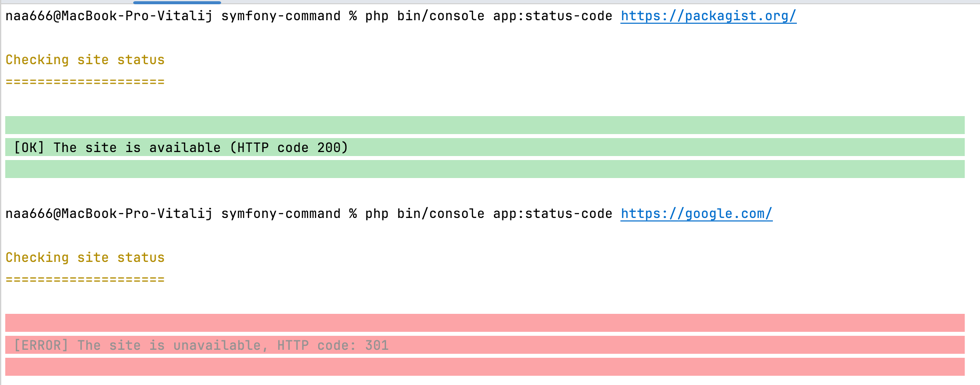
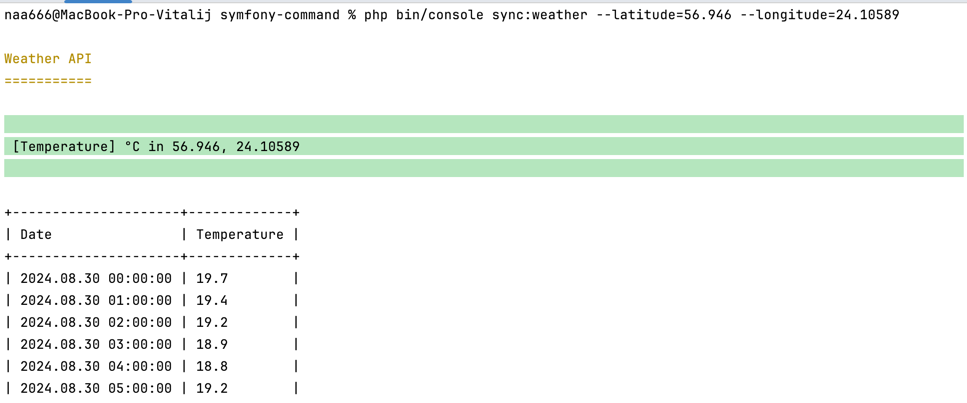

## Symfony | StatusCode | WeatherApi

```
composer install
```

### Commands
```
php bin/console app:status-code https://packagist.org/
php bin/console sync:weather --latitude=56.946 --longitude=24.10589
```




